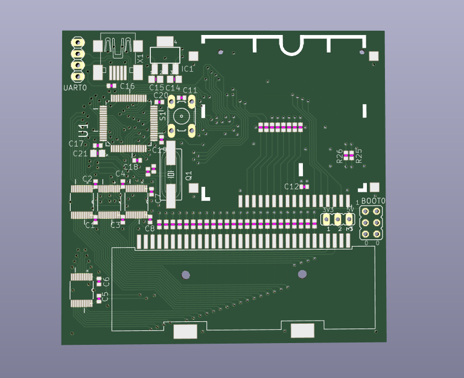

# STM32 GBA NDS Reader PCB

## Overview

In this repository you can find the hardware/PCB files, which belong to the [software](https://github.com/ipatix/stm32-gba-nds-cart-reader), which has been on my Github account for quite while.

This PCB hardware allows you to physically communicate with NDS, DSi, GBA, and GBC carts (GBA/GBC switching via 5V/3V3 jumper).
Anything else related to the funcionality is part of the software and not explained here.

## Components

All of the components except the card headers should be avaiable on Mouser or other distributers.
The card headers I orderd on Aliexpress, and they were probably not much more than $1 a piece.
Though, they may be difficult to source in the future.

## Bugs

I ordered one batch of PCBs of this design.
Since then I never fixed the bugs that I discovered later.
Here is a list of known bugs:
- USB D+ line is missing the pull-up resistor.
  It's a bit tricky, but you can connect D+ to 3V3 on C20 using a 1.5k resistor.
- The direction pin U2 and U3 should have had pull-up/down resistor.
  That is because one of the STM32's boot pins is connected to one of the IOs of U2.
  This is a problem because the direction of IC U2 is undefined and may drive the BOOT1 pin before the STM32 has booted up.
  For some reason this was never turned out to be a problem on the boards I've tested, but this is definitely an issue that should have been fixed.

## General Design Improvements

So what did I not do thing A or thing B better in this design?
Well, turns out, I was learning PCB design.

Yes, resistor arrays are a thing and are probably much easier to solder by hand than the countless 0402 resistors/capacitors on the PCB.

Yes, it would have been more appropriate to use a more standard 74xx245 bus transceiver.
Perhaps they were even completely unnecessary, since the STM32 does have some IO banks, which are 5V tolerant and 5V game cards would probably detect 3.3V as logic high...

## History

This project was originally designed in EAGLE version 7.
In this repo you can only find the conversion to KiCAD, since I personally don't use EAGLE anymore and KiCAD is more accessible.
However, I don't know how reliable the conversion is, so it's possible there are some bugs.
